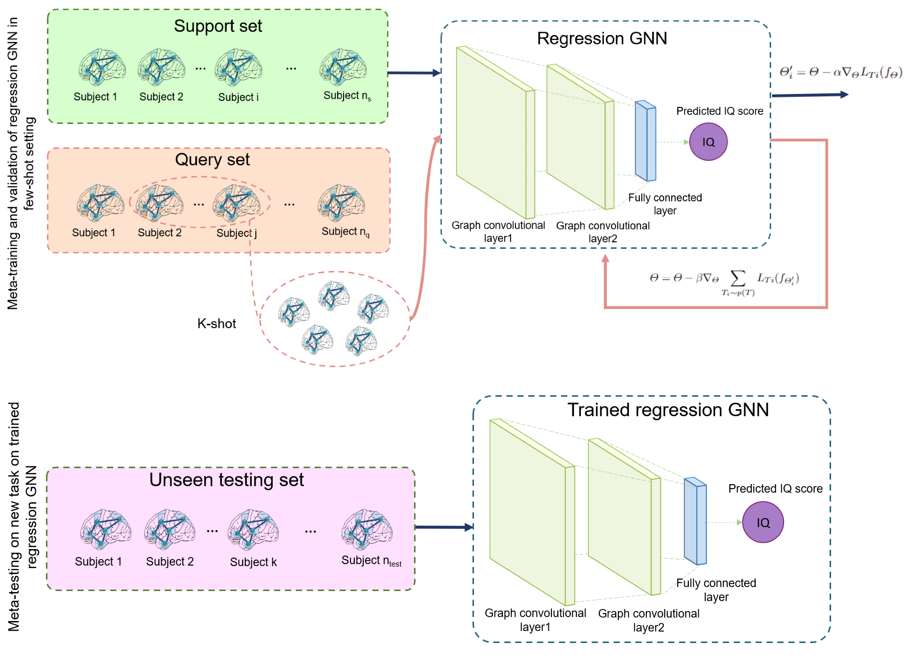

# Meta-RegGNN
How to predict intelligence from the human brain network?

Please contact jeghamm.imen@gmail.com for inquiries. Thanks. 



# Introduction
Meta-RegGNN, a graph neural network architecture for many-to-one regression tasks through meta-learning. It handles domain shifts in training and testing data distribution when predicting behavioral scores from functional brain connectomes.
This work is accepted as oral presentation at the International Workshop on PRedictive Intelligence In MEdicine (PRIME) MICCAI 2022 workshop.

> **Meta-RegGNN: Predicting Verbal and Full-Scale Intelligence Scores using Graph Neural Networks and Meta-Learning**
>
>Imen Jegham and Islem Rekik
>
> BASIRA Lab, Faculty of Computer and Informatics, Istanbul Technical University, Istanbul, Turkey
> 
>Université de Sousse, Ecole Nationale d'Ingénieurs de Sousse, LATIS-Laboratory of Advanced Technology and Intelligent Systems, 4023, Sousse, Tunisie;
>
>Horizon School of Digital Technologies, 4023, Sousse, Tunisie;
>
> **Abstract:** *Decrypting intelligence from the human brain construct is vital in the detection of particular neurological disorders. Recently, functional brain connectomes have been used successfully to predict behavioral scores. However, state-of-the-art methods, on one hand, neglect the topological properties of the connectomes and, on the other hand, fail to solve the high inter-subject brain heterogeneity. To address these limitations, we propose a novel regression graph neural network through meta-learning namely Meta-RegGNN for predicting behavioral scores from brain connectomes. The parameters of our proposed regression GNN are explicitly trained so that a small number of gradient steps combined with a small training data amount produces a good generalization to unseen brain connectomes. Our results on verbal and full-scale intelligence quotient (IQ) prediction outperform existing methods in both neurotypical and autism spectrum disorder cohorts. Furthermore, we show that our proposed approach ensures generalizability, particularly for autistic subjects.*


## Code
This code was implemented using Python 3.6 on Ubuntu 18.04.
```diff
 You can edit config.py file to configure our Meta-RegGNN method according to your needs.
```
### Credits
Code for Meta-RegGNN is written by  [Imen Jegham](https://tn.linkedin.com/in/imen-jegham-503352ba).
Code for RegGNN model is written by by [Mehmet Arif Demirtaş](https://web.itu.edu.tr/demirtasm18/), [available in this repository](https://github.com/basiralab/RegGNN).


### Dependencies
Code for Meta-RegGNN was prepared using Python 3.6. The full list of dependencies can be found in requirements.txt.
Most packages can be installed using the command:
 ```pip install -r requirements.txt``` 

### Preparing Data for Meta-RegGNN
```demo.py``` file can be used to prepare real data for usage in Meta-RegGNN by simulating functional brain connectome data and create topological features.
 For that, use the following command:
```bash

python demo.py --mode data --data-source simulated 

```

### Using Meta-RegGNN on Prepared Data

```demo.py``` file can also be used to apply cross-validation on prepared data using the preprocess commands above, using the parameters specified in ```config.py``` file. 

To use Meta-RegGNN model on data:

```bash

python demo.py --mode infer
```

### Configuration options
Different options for models and data can be specified using ```config.py``` file. The options used throughout the program are as follows:

RegGNN options:

- ```NUM_EPOCH```: number of epochs the process will be run for

- ```LR```: learning rate

- ```WD```: weight decay

- ```DROPOUT```: dropout rate
 
Meta-learning  options:

- ```gamma```: Step size hyperparameter
 
- ```eta```: Meta-step size hyperparameter

System options:

- ```DATA_FOLDER```: path to the folder data will be written to and read from

- ```RESULT_FOLDER```: path to the folder data will be written to and read from

Simulated data options:

- ```CONNECTOME_MEAN```: mean of the distribution from which connectomes will be sampled

- ```CONNECTOME_STD```: std of the distribution from which connectomes will be sampled

- ```SCORE_MEAN```: mean of the distribution from which scores will be sampled

- ```SCORE_STD```: std of the distribution from which scores will be sampled

- ```N_SUBJECTS```: number of subjects in the simulated data

- ```ROI```: number of regions of interest in brain graph

- ```SPD```: whether or not to make generated matrices symmetric positive definite

Evaluation options:

- ```K_FOLDS```: number of cross validation folds


## Example Result
When given the functional brain connectomes, MetaRegGNN.py can produce behavioral scores (Verbal Intelligence Quotient (VIQ) and Full-scale Intelligence Quotient (FIQ) ).

## Relevant References
Hanik, M., Demirta¸s, M.A., Gharsallaoui, M.A., Rekik, I.: Predicting cognitive scores with graph neural networks through sample selection learning. Brain Imaging and Behavior 16 (2022).
Finn, C., Abbeel, P., Levine, S.: Model-agnostic meta-learning for fast adaptation of deep networks. In: International conference on machine learning, PMLR (2017).


## Please cite the following paper when using Meta-RegGNN
```latex
  @inproceedings{jeghamrekik2022,
    title={Meta-RegGNN: Predicting Verbal and Full-Scale Intelligence Scores},
    author={Jegham, Imen and Rekik, Islem},
    booktitle={International Workshop on PRedictive Intelligence In MEdicine},
    year={2022},
    organization={Springer}
  }
```
